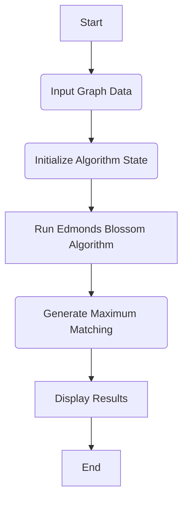

# 🚀 Edmonds Blossom Algorithm Implementation

<p align="center"></p>

## Short Description
Dive deep into the fascinating world of graph theory with this robust C++ implementation of the **Edmonds Blossom Algorithm**! This project provides a clear, efficient, and well-documented solution for finding a maximum cardinality matching in general graphs, including those with odd cycles (blossoms). Whether you're a student, researcher, or competitive programmer, this repository offers a solid foundation and insightful visual demonstrations to conquer one of the most elegant problems in graph theory.

## ✨ Key Features
*   **Accurate Implementation:** A faithful and efficient C++ rendition of Jack Edmonds' renowned Blossom Algorithm.
*   **General Graph Support:** Handles arbitrary graphs, correctly identifying and contracting odd cycles to find optimal matchings.
*   **Visual Demonstrations:** Includes animated GIFs (`Inputs.gif`, `Matching.gif`) to help visualize the algorithm's operation and results.
*   **Comprehensive Report:** A detailed PDF report (`Report_Implementation_of_Edmonds_Blossom_Algorithm.pdf`) provides an in-depth explanation, theoretical background, and implementation insights.
*   **Clear Codebase:** `graph.cpp` is designed for readability and maintainability, making it easy to understand and extend.

## Who is this for?
*   **Computer Science Students:** Ideal for understanding advanced graph algorithms, especially in courses on algorithms, discrete mathematics, or operations research.
*   **Researchers:** A reliable base for extending or experimenting with maximum matching problems and related graph structures.
*   **Competitive Programmers:** A valuable resource for tackling challenging graph problems that require efficient matching solutions.
*   **Algorithm Enthusiasts:** Anyone with a keen interest in elegant algorithmic solutions to complex problems.

## Technology Stack & Architecture
*   **Core Language:** C++
*   **Concepts:** Advanced Graph Theory, Data Structures (Adjacency Lists/Matrices), BFS/DFS-like traversal for augmenting paths, Dynamic Graph Modification (Blossom Contraction).

## 📊 Architecture & Database Schema
This project's architecture can be visualized as a straightforward pipeline for graph processing:



## ⚡ Quick Start Guide
To get this powerful algorithm running on your machine:

1.  **Clone the Repository:**
    ```bash
    git clone https://github.com/grewal16/edmonds-blossom-algorithm.git
    cd edmonds-blossom-algorithm
    ```
2.  **Compile the C++ Code:**
    ```bash
    g++ graph.cpp -o graph
    ```
3.  **Run the Executable:**
    ```bash
    ./graph
    ```
    The program will likely prompt for graph input or process pre-defined structures. Refer to the `Report_Implementation_of_Edmonds_Blossom_Algorithm.pdf` for specific input formats and detailed usage.

## 📜 License
This project is licensed under the **MIT License**. See the `LICENSE` file for full details.
