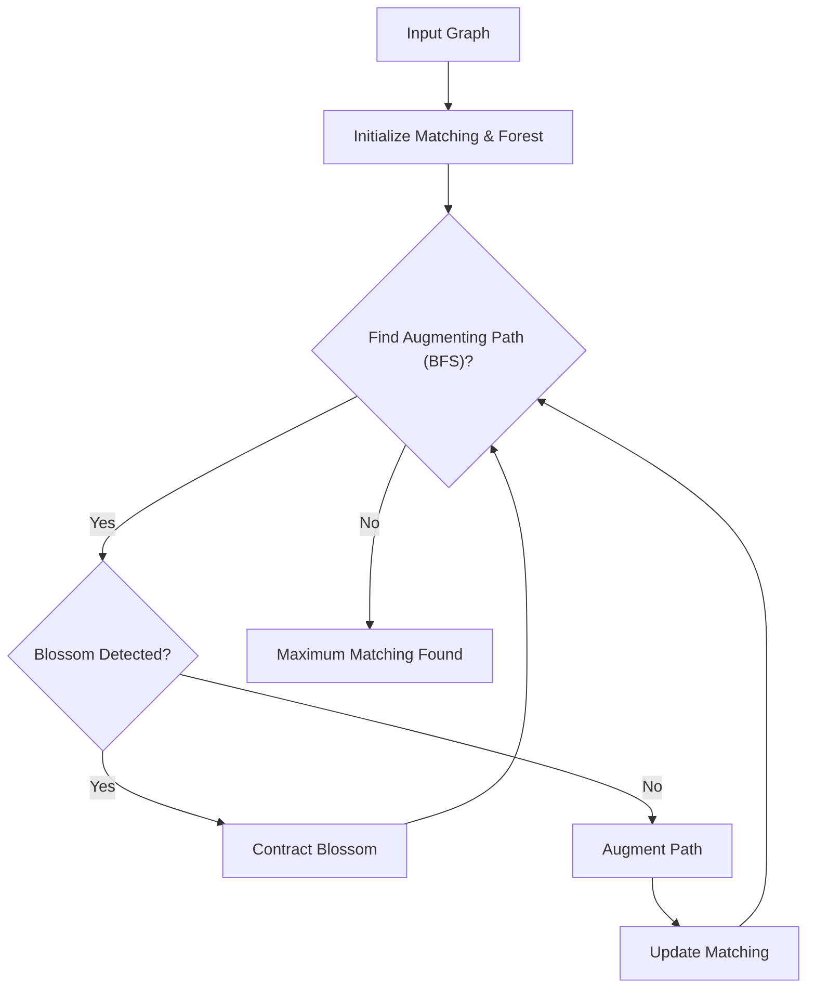

# 🚀 Edmonds Blossom Algorithm Implementation

This repository provides a robust and meticulously engineered C++ implementation of the **Edmonds Blossom Algorithm**, a foundational graph theory algorithm for finding maximum cardinality matchings in general graphs (non-bipartite). Dive into the core mechanics of one of computer science's most elegant solutions to the matching problem.

## Short Description
The Edmonds Blossom Algorithm is a cornerstone in combinatorial optimization, offering an efficient method to discover the largest possible set of non-adjacent edges within any given graph. This project delivers a high-performance C++ implementation, complete with detailed documentation and visual demonstrations, making complex graph matching accessible to students, researchers, and developers alike.

## ✨ Key Features
*   **Optimal Matching:** Accurately computes maximum cardinality matchings in general graphs, extending beyond the limitations of bipartite matching algorithms.
*   **C++ Performance:** Engineered in C++ for speed and efficiency, suitable for handling graphs of varying sizes.
*   **Comprehensive Documentation:** Includes a dedicated PDF report (`Report_Implementation_of_Edmonds_Blossom_Algorithm.pdf`) detailing the algorithm's theory, implementation specifics, and usage.
*   **Visual Demonstrations:** Illustrative GIFs (`Inputs.gif`, `Matching.gif`) provide clear examples of graph inputs and the resulting maximum matching process.
*   **Clean & Modular Codebase:** `graph.cpp` encapsulates the algorithm's logic, making it easy to understand and integrate.

## Who is this for?
*   **Computer Science Students:** An invaluable resource for understanding advanced graph algorithms, particularly matching theory and the intricacies of the Edmonds Blossom algorithm.
*   **Researchers:** A reliable, well-documented implementation for experimental use or as a building block in larger graph-theoretic research.
*   **Software Developers:** Anyone requiring a robust solution for maximum matching in real-world applications where general graph structures are involved.
*   **Algorithm Enthusiasts:** Individuals passionate about the elegance and power of combinatorial algorithms.

## Technology Stack & Architecture
This project is built primarily using **C++**, leveraging standard library features for graph representation and algorithmic logic. The architecture is straightforward: a single C++ source file (`graph.cpp`) contains the entire implementation, focusing on clarity and algorithmic correctness. The core components revolve around graph data structures, Breadth-First Search (BFS) for path finding, and the unique blossom detection and contraction/expansion mechanisms central to Edmonds' algorithm.

## 📊 Architecture & Database Schema
The Edmonds Blossom Algorithm is a process-oriented solution. Below is a simplified flowchart illustrating the high-level operational flow of the algorithm.



## ⚡ Quick Start Guide
To get this powerful algorithm up and running, follow these simple steps:

1.  **Clone the Repository:**
    ```bash
    git clone https://github.com/grewal16/edmonds-blossom-algorithm.git
    cd edmonds-blossom-algorithm
    ```
2.  **Compile the Source Code:**
    You'll need a C++ compiler (like g++).
    ```bash
    g++ graph.cpp -o blossom
    ```
3.  **Run the Executable:**
    Execute the compiled program. It will typically expect graph input (refer to the detailed PDF report for exact input formats).
    ```bash
    ./blossom
    ```
4.  **Explore Documentation:**
    For a deep dive into the algorithm, its usage, and implementation details, consult the `Report_Implementation_of_Edmonds_Blossom_Algorithm.pdf` file. Observe the provided `Inputs.gif` and `Matching.gif` for visual examples.

## 📜 License
This project is distributed under an open-source license. See the `LICENSE` file in the repository root for complete details.