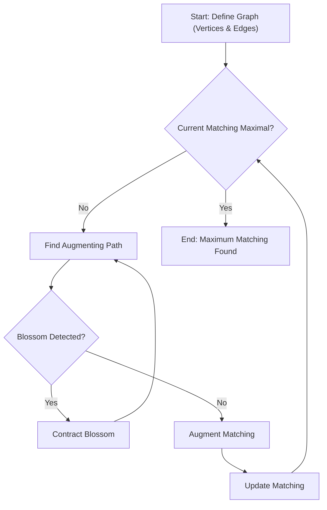

# 🚀 Edmonds Blossom Algorithm Implementation

This repository presents a robust and efficient C++ implementation of the **Edmonds Blossom Algorithm**, a foundational algorithm in graph theory for finding maximum cardinality matchings in general graphs. Unlike simpler matching algorithms that only work on bipartite graphs, the Edmonds Blossom Algorithm conquers the complexity of arbitrary graphs, including those with odd cycles (blossoms), making it an indispensable tool for advanced graph problems.

## Short Description
Dive deep into the world of combinatorial optimization with this C++ implementation of the Edmonds Blossom Algorithm. Designed for clarity and performance, this project provides a practical solution for computing maximum matchings in any graph, accompanied by illustrative examples and a detailed theoretical report.

## ✨ Key Features
*   **Complete C++ Implementation:** A well-structured and optimized C++ codebase for the Edmonds Blossom Algorithm.
*   **Handles General Graphs:** Effectively computes maximum cardinality matchings in any graph, including those containing odd cycles.
*   **Visual Learning Aids:** Includes `Inputs.gif` and `Matching.gif` to visually demonstrate graph inputs and the matching process.
*   **Comprehensive Documentation:** Accompanied by `Report_Implementation_of_Edmonds_Blossom_Algorithm.pdf`, a detailed report explaining the algorithm's theory and implementation specifics.
*   **Efficient Problem Solving:** Provides a solid foundation for tackling complex graph optimization challenges.

## Who is this for?
*   **Computer Science Students:** An excellent resource for understanding advanced graph algorithms and data structures.
*   **Researchers:** A reliable implementation for experimental work in graph theory, combinatorial optimization, and algorithm analysis.
*   **Competitive Programmers:** A powerful tool for solving problems involving maximum matchings in general graphs.
*   **Algorithm Enthusiasts:** Anyone eager to explore the elegance and complexity of one of graph theory's most significant algorithms.

## Technology Stack & Architecture
*   **Primary Language:** C++
*   **Core Algorithm:** Edmonds Blossom Algorithm
*   **Project Structure:** A single-file C++ implementation (`graph.cpp`) focused purely on the algorithm's logic, making it easy to integrate and understand.

## 📊 Architecture & Database Schema
This project is an algorithmic implementation rather than a database-driven application. Therefore, an Entity-Relationship Diagram (ERD) is not applicable. Instead, we visualize the high-level operational flow of the Edmonds Blossom Algorithm as implemented.


This flowchart illustrates the iterative process: the algorithm continuously searches for augmenting paths. If an odd cycle (blossom) is encountered, it's contracted to simplify the graph, and the search continues. Once an augmenting path is found, the matching is updated, and the process repeats until no more augmenting paths can be found, signifying a maximum matching.

## ⚡ Quick Start Guide
To get this powerful algorithm running on your machine:

1.  **Clone the Repository:**
    ```bash
    git clone https://github.com/grewal16/edmonds-blossom-algorithm.git
    ```
2.  **Navigate to Project Directory:**
    ```bash
    cd edmonds-blossom-algorithm
    ```
3.  **Compile the C++ Code:**
    ```bash
    g++ graph.cpp -o edmonds_blossom
    ```
4.  **Run the Executable:**
    ```bash
    ./edmonds_blossom
    ```
    The program will then await graph input, typically provided through standard input in a format like: first line `N M` (number of vertices, number of edges), followed by `M` lines each containing `u v` for an edge between vertex `u` and `v`.

## 📜 License
A license file is present in the repository.
