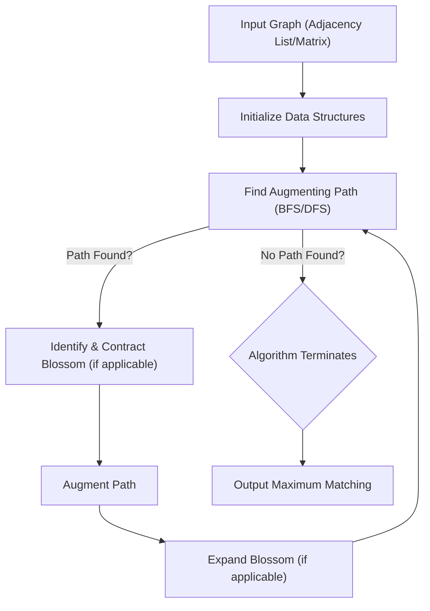

# 🚀 edmonds-blossom-algorithm

<p align="center"></p>

<p align="center">
  <a href="https://github.com/grewal16/edmonds-blossom-algorithm/stargazers"></a>
  <a href="https://github.com/grewal16/edmonds-blossom-algorithm/network/members"></a>
  <a href="https://github.com/grewal16/edmonds-blossom-algorithm/issues"></a>
  <a href="./LICENSE"></a>
</p>

## Short Description
Dive into the heart of graph theory with this robust C++ implementation of the renowned Edmonds Blossom Algorithm! Designed to find maximum cardinality matchings in general graphs, this project offers a clear, efficient, and well-documented solution for a fundamental problem in combinatorial optimization.

## 🛡️ Project Health & Status
This project is a stable, self-contained implementation, best categorized as a Proof-of-Concept / Educational Tool. It focuses on the core algorithm logic without external dependencies beyond standard C++ libraries, making it ideal for study and direct application where understanding the algorithm is paramount.

## ✨ Key Features
*   **Pure C++ Implementation:** A lean, high-performance solution leveraging standard C++ features.
*   **Maximum Cardinality Matching:** Efficiently computes the largest possible matching in any given general graph.
*   **Blossom Contraction Handling:** Accurately implements the intricate blossom contraction and expansion steps central to Edmonds' algorithm.
*   **Clear and Understandable Codebase:** Designed for easy comprehension and further academic exploration.
*   **Illustrative Examples:** Accompanied by `.gif` visualizations (e.g., `Inputs.gif`, `Matching.gif`) demonstrating algorithm behavior.

## Who is this for?
This repository is an invaluable resource for:
*   **Computer Science Students:** Gaining a deeper understanding of advanced graph algorithms.
*   **Algorithm Enthusiasts:** Exploring classic solutions to combinatorial optimization problems.
*   **Researchers:** As a foundational component or reference for graph matching studies.
*   **Competitive Programmers:** A ready-to-use, efficient implementation for contest problems.

## Technology Stack & Architecture
*   **Core Language:** C++
*   **Build System:** Standard C++ Compiler (e.g., g++)
*   **Libraries:** Standard C++ Library only.

## 📊 Architecture & Database Schema
The project's architecture is a direct, single-module implementation of the Edmonds Blossom algorithm. The core logic handles graph input, processes paths, contracts and expands "blossoms" to find augmenting paths, and ultimately determines the maximum matching.



## ⚙️ Configuration & Deployment
No complex configuration or deployment steps are required. The project is a standalone C++ source file. Compilation typically involves a standard C++ compiler, and execution is direct.

## ⚡ Quick Start Guide
To get this powerful algorithm running on your local machine:

1.  **Clone the repository:**
    ```bash
    git clone https://github.com/grewal16/edmonds-blossom-algorithm.git
    cd edmonds-blossom-algorithm
    ```
2.  **Compile the source code:**
    ```bash
    g++ graph.cpp -o edmonds_blossom -std=c++11 -O2
    ```
    (Ensure you have a C++ compiler like `g++` installed.)
3.  **Run the executable:**
    ```bash
    ./edmonds_blossom
    ```
    (The program will likely expect graph input via `stdin` or a file, as is common for algorithm implementations.)

## 📜 License
This project is open-sourced under the MIT License. See the `LICENSE` file for more details.