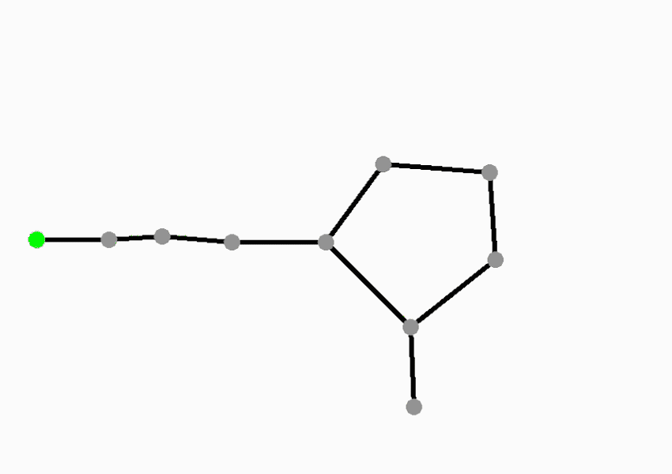
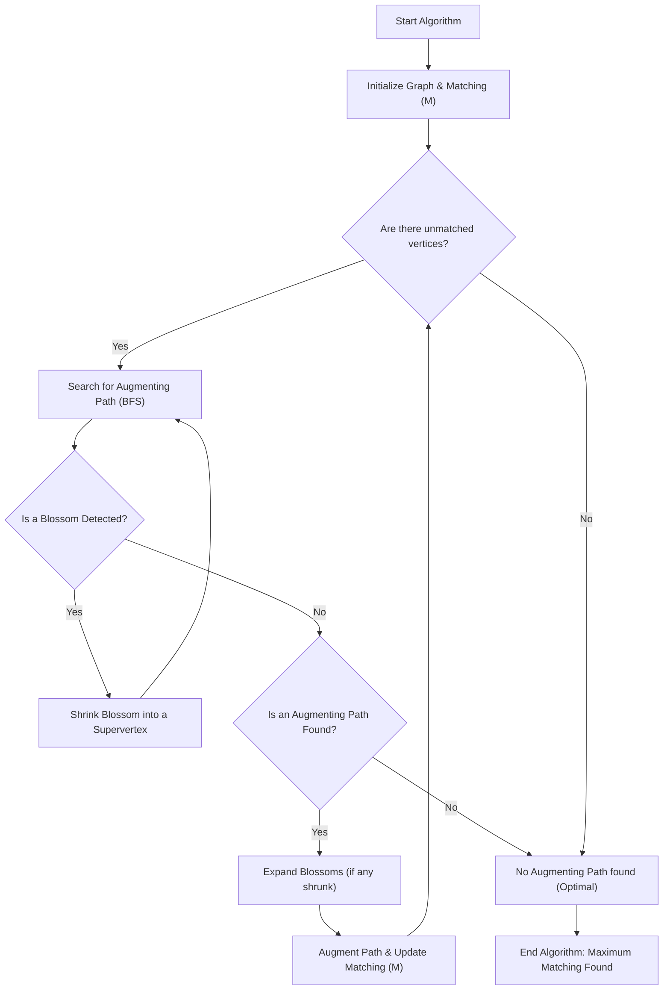

# 🚀 Edmonds Blossom Algorithm Implementation

<p align="center"></p>

## Short Description
Dive deep into the fascinating world of graph theory with this robust C++ implementation of the **Edmonds Blossom Algorithm**. This project provides an efficient and clear solution for finding maximum matchings in general graphs, a fundamental problem in computer science and combinatorial optimization. Accompanying the code is a comprehensive report and insightful GIFs to clarify the algorithm's complex steps and visual outcomes.

## ✨ Key Features
*   **🚀 Powerful Algorithm:** A direct and optimized C++ implementation of Jack Edmonds' renowned Blossom algorithm.
*   **🌐 General Graph Matching:** Capable of finding maximum matchings in any general graph, including those with odd cycles (blossoms).
*   **📊 Visual Demonstrations:** Includes animated GIFs (`Inputs.gif`, `Matching.gif`) that visually illustrate the algorithm's process and final matching results.
*   **📚 Comprehensive Documentation:** Supported by a detailed PDF report (`Report_Implementation_of_Edmonds_Blossom_Algorithm.pdf`) explaining the theoretical underpinnings, implementation details, and analysis.
*   **💡 Educational Resource:** An excellent resource for students, researchers, and developers looking to understand and apply advanced graph algorithms.

## Who is this for?
This project is ideal for:
*   **Computer Science Students:** Gaining a deeper understanding of graph theory, algorithms, and data structures.
*   **Algorithm Enthusiasts:** Exploring the elegant solution to the maximum matching problem in general graphs.
*   **Researchers:** As a foundation or reference for further work in graph algorithms and optimization.
*   **C++ Developers:** Examining a well-structured C++ implementation of a complex algorithm.

## Technology Stack & Architecture
*   **Language:** C++ (for core algorithm implementation)
*   **Core Logic:** The entire algorithm's implementation resides within `graph.cpp`, signifying a self-contained and focused approach. No external frameworks or complex dependencies are evident, promoting a lean and high-performance execution.

## 📊 Architecture & Database Schema
This project focuses on an algorithmic implementation rather than a database. Below is a high-level flowchart illustrating the core steps of the Edmonds Blossom Algorithm for finding a maximum matching.



## ⚡ Quick Start Guide
To get this powerful algorithm running on your local machine, follow these simple steps:

1.  **Clone the Repository:**
    ```bash
    git clone https://github.com/grewal16/edmonds-blossom-algorithm.git
    cd edmonds-blossom-algorithm
    ```

2.  **Compile the C++ Code:**
    Ensure you have a C++ compiler (like `g++`) installed.
    ```bash
    g++ -std=c++11 graph.cpp -o edmonds_blossom
    ```

3.  **Run the Executable:**
    Execute the compiled program. The `graph.cpp` file likely contains example usage or expects input via `stdin`.
    ```bash
    ./edmonds_blossom
    ```
    Refer to the `Report_Implementation_of_Edmonds_Blossom_Algorithm.pdf` for detailed instructions on inputs and expected outputs.

## 📜 License
This project is released under the terms specified in the `LICENSE` file. Please review the `LICENSE` file for details on usage, distribution, and modification.
