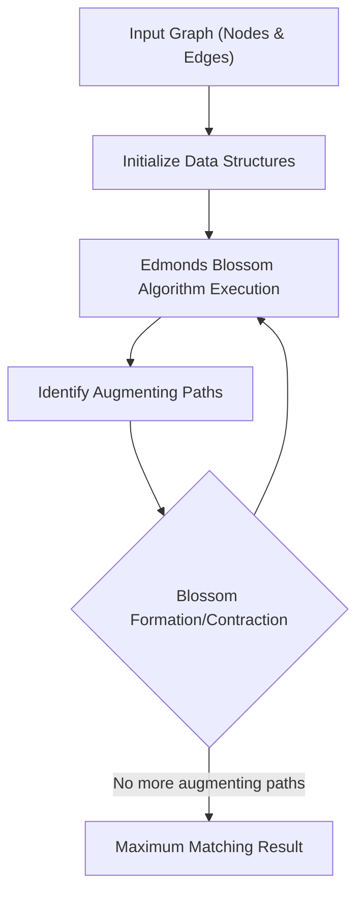

# 🚀 Edmonds Blossom Algorithm

<p align="center"></p>

<p align="center">
  <a href="https://github.com/grewal16/edmonds-blossom-algorithm/stargazers"></a>
  <a href="https://github.com/grewal16/edmonds-blossom-algorithm/network/members"></a>
  <a href="https://github.com/grewal16/edmonds-blossom-algorithm/issues"></a>
  <a href="./LICENSE"></a>
</p>

## Short Description
Dive deep into the heart of graph theory with this cutting-edge C++ implementation of the celebrated Edmonds Blossom Algorithm! This project provides a robust, efficient, and thoroughly documented solution for finding maximum weight matchings in general graphs. Witness the algorithmic magic unfold, from initial graph inputs to the precise identification of maximum matchings, making complex graph problems accessible and solvable.

## 🛡️ Project Health & Status
This project represents a mature and academically sound implementation of a fundamental algorithm. With comprehensive documentation provided in an accompanying report and visual demonstrations, it's a solid foundation for study, research, and integration into larger graph processing systems.

## ✨ Key Features
*   **High-Performance C++ Implementation**: Leverages the power of C++ for optimal execution speed.
*   **Maximum Matching**: Accurately computes maximum matchings in any general graph.
*   **Visual Demonstrations**: Intuitive GIF animations (`Inputs.gif`, `Matching.gif`) illustrate the algorithm's operation from input to output.
*   **Comprehensive Documentation**: Accompanied by a detailed PDF report (`Report_Implementation_of_Edmonds_Blossom_Algorithm.pdf`) explaining the algorithm and implementation nuances.
*   **Clear & Modular Codebase**: `graph.cpp` encapsulates the algorithm logic in an understandable structure.

## Who is this for?
This repository is an invaluable resource for:
*   **Computer Science Students**: Ideal for understanding advanced graph algorithms and data structures.
*   **Researchers**: Provides a reliable C++ base for maximum matching problems in various domains.
*   **Algorithm Enthusiasts**: Anyone passionate about the elegance and power of classic algorithmic solutions.
*   **Developers**: Seeking a high-performance C++ library component for graph analysis.

## Technology Stack & Architecture
This project is built primarily with:
*   **C++**: The core logic and implementation are written in modern C++.

## 📊 Architecture & Database Schema
The Edmonds Blossom Algorithm is a procedural graph algorithm, focusing on graph traversal and manipulation. Below is a high-level flowchart depicting its operational flow:



## ⚙️ Configuration & Deployment
This project is a standalone C++ application. It requires a standard C++ compiler (like GCC or Clang) to build. No complex configuration files or external dependencies are typically needed beyond a C++ toolchain.

## ⚡ Quick Start Guide
To get the Edmonds Blossom Algorithm up and running, simply follow these steps:

1.  **Clone the Repository**:
    ```bash
    git clone https://github.com/grewal16/edmonds-blossom-algorithm.git
    cd edmonds-blossom-algorithm
    ```
2.  **Compile the C++ Code**:
    ```bash
    g++ graph.cpp -o edmonds_blossom
    ```
3.  **Run the Executable**:
    ```bash
    ./edmonds_blossom
    ```
    (Note: Input format may vary based on implementation details within `graph.cpp`. Refer to the `Report_Implementation_of_Edmonds_Blossom_Algorithm.pdf` for specific usage instructions.)

## 📜 License
This project is licensed under the terms found in the [LICENSE](./LICENSE) file.