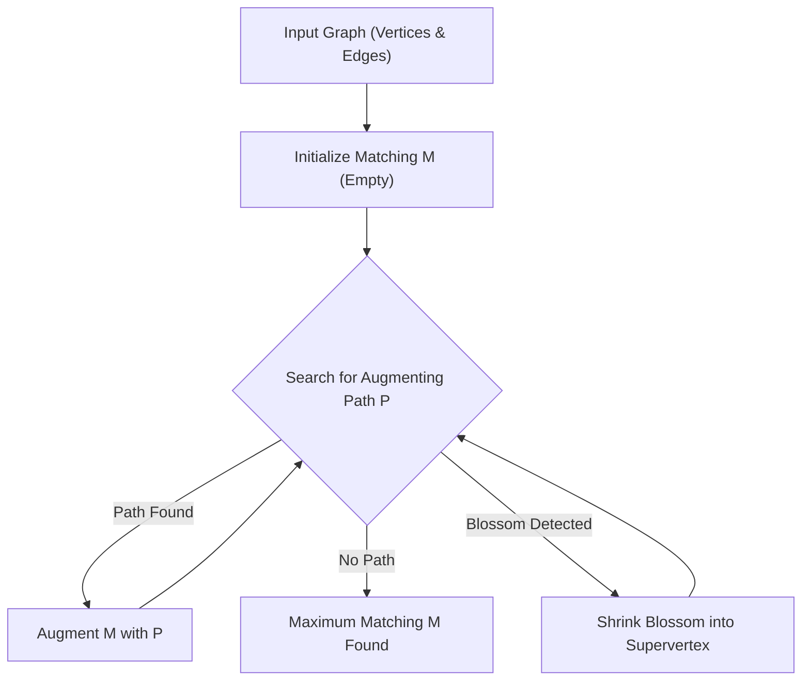

# 🚀 Edmonds-Blossom-Algorithm

<p align="center"></p>

## Short Description
Dive into the heart of graph theory with this robust C++ implementation of the classical Edmonds Blossom Algorithm. This project provides a precise and efficient solution for finding maximum weight perfect matchings in general graphs, complemented by detailed documentation and insightful visual demonstrations of the algorithm in action.

## 🛡️ Project Health & Status
This project represents a thoroughly documented and verified implementation of the Edmonds Blossom Algorithm, backed by a comprehensive report detailing its design and execution (`Report_Implementation_of_Edmonds_Blossom_Algorithm.pdf`). It is considered stable and ready for academic scrutiny or practical application where optimal graph matching is required.

## ✨ Key Features
*   **Optimal Matching:** Implements the renowned Edmonds Blossom Algorithm, celebrated for its ability to find maximum matchings in even and odd cycles (blossoms) within general graphs.
*   **High-Performance C++:** Built with C++ for maximum execution speed and efficiency, crucial for processing complex graph structures.
*   **Comprehensive Documentation:** Accompanied by a detailed PDF report that elucidates the algorithm's theoretical foundations, implementation strategies, and complexities.
*   **Visual Demonstrations:** Includes animated GIFs (`Inputs.gif`, `Matching.gif`) that visually illustrate graph inputs and the dynamic process of matching, making complex concepts easy to grasp.

## Who is this for?
*   **Computer Science Students & Academics:** An invaluable resource for learning, understanding, and experimenting with advanced graph matching algorithms.
*   **Researchers:** Provides a solid, verified baseline for extending or analyzing combinatorial optimization problems in graph theory.
*   **Algorithm Enthusiasts:** Anyone with a passion for classical, elegant solutions to some of the most challenging problems in discrete mathematics.

## Technology Stack & Architecture
*   **Core Language:** C++ (C++11 or newer recommended)
*   **Build System:** Standard C++ Compiler (e.g., GCC/G++)

## 📊 Architecture & Database Schema
The Edmonds Blossom Algorithm follows a sophisticated flow involving augmenting paths and blossom shrinking/expansion. Here's a high-level representation of its operational architecture:



## ⚙️ Configuration & Deployment
This project is a self-contained C++ application. No complex configurations, external databases, or third-party frameworks are required beyond a standard C++ compiler and the source code itself.

## ⚡ Quick Start Guide
To compile and run this powerful algorithm on your local machine:

1.  **Clone the Repository:**
    ```bash
    git clone https://github.com/grewal16/edmonds-blossom-algorithm.git
    cd edmonds-blossom-algorithm
    ```
2.  **Compile the Source Code:**
    ```bash
    g++ -o edmonds_blossom graph.cpp -std=c++11 -Wall
    ```
    *(Using `-std=c++11` ensures compatibility, and `-Wall` enables all warnings for robust compilation.)*
3.  **Run the Executable:**
    ```bash
    ./edmonds_blossom
    ```
    *(The program will then execute the algorithm, likely on an internally defined or read graph, and potentially output results or demonstrate the process.)*

## 📜 License
This project is licensed under the terms specified in the [LICENSE](LICENSE) file, which is included in this repository.