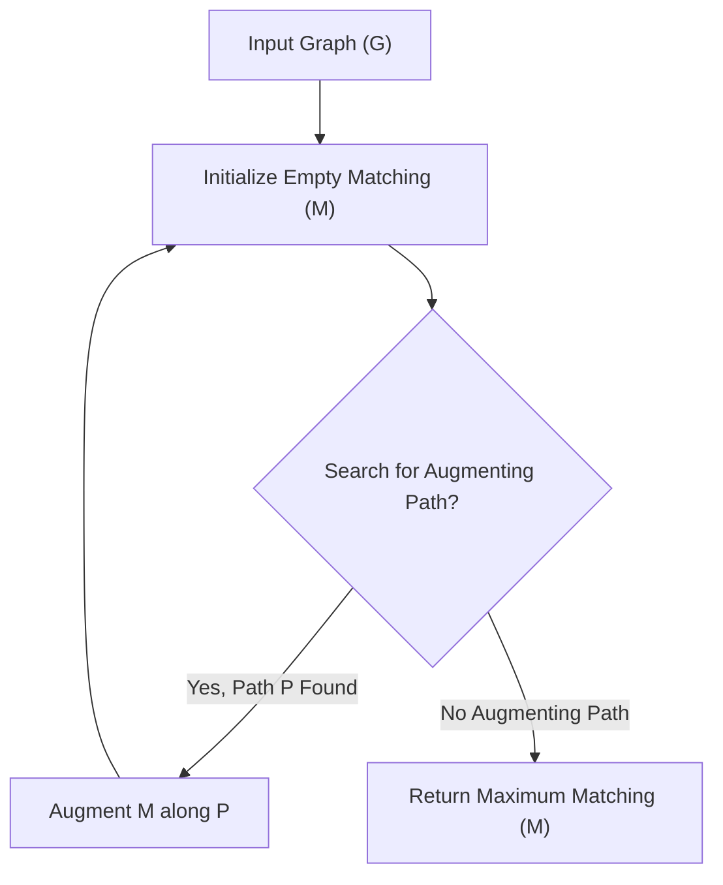

# 🚀 Edmonds Blossom Algorithm Implementation

## Short Description
Dive deep into graph theory with this robust C++ implementation of Edmonds' Blossom Algorithm, designed to efficiently compute maximum cardinality matchings in general graphs. Beyond mere code, this project offers clear visualizations and an in-depth theoretical report, making complex graph matching concepts accessible to both learners and experienced practitioners.

## ✨ Key Features
*   **Optimal Matching:** Solves the critical problem of finding maximum cardinality matchings in any general graph (not just bipartite graphs).
*   **High-Performance C++:** Engineered in C++ for maximum performance and efficiency, making it suitable for demanding algorithmic challenges and research.
*   **Visual Demonstrations:** Includes `Inputs.gif` and `Matching.gif` to visually illustrate algorithm execution, input parsing, and the resulting maximum matching.
*   **Comprehensive Report:** Accompanied by `Report_Implementation_of_Edmonds_Blossom_Algorithm.pdf` for a thorough theoretical understanding, detailed implementation breakdown, and complexity analysis.
*   **Educational Resource:** Serves as an excellent resource for students and researchers looking to learn, understand, and implement advanced graph algorithms.

## Who is this for?
This project is an invaluable asset for:
*   **Computer Science Students:** Gaining a deeper understanding of advanced graph algorithms and their practical implementation.
*   **Algorithm Researchers:** Exploring and validating graph matching techniques for theoretical or applied work.
*   **Competitive Programmers:** Optimizing solutions for complex graph-related problems that require efficient maximum matching.
*   **Developers:** Seeking a solid, well-documented C++ foundation for integrating sophisticated matching logic into their applications.

## Technology Stack & Architecture
The core of this project is built with:
*   **C++:** Leveraging its power for efficient data structures, low-level memory management, and fast algorithmic execution.

The architecture is focused on a standalone command-line application. It is designed to take graph input (format detailed in the accompanying report), process it using the carefully implemented Edmonds' Blossom Algorithm, and then output the determined maximal matching.

## 📊 Architecture & Database Schema
Below is a high-level flowchart illustrating the primary workflow of the Edmonds' Blossom Algorithm as implemented in this project:



## ⚡ Quick Start Guide
Get the Edmonds' Blossom Algorithm up and running on your local machine in minutes:

1.  **Clone the Repository:**
    Start by cloning the project to your local development environment:
    ```bash
    git clone https://github.com/grewal16/edmonds-blossom-algorithm.git
    cd edmonds-blossom-algorithm
    ```
2.  **Compile the Source Code:**
    Ensure you have a C++ compiler (like g++) installed. Compile the `graph.cpp` file:
    ```bash
    g++ graph.cpp -o edmonds_blossom
    ```
3.  **Run the Algorithm:**
    Execute the compiled program. The program is designed to accept graph input, likely through standard input or via a file. Refer to `Report_Implementation_of_Edmonds_Blossom_Algorithm.pdf` for precise input specifications and examples.
    ```bash
    ./edmonds_blossom
    # Example: You might pipe input from a file or type it interactively.
    # e.g., cat my_graph_input.txt | ./edmonds_blossom
    ```
    Observe the output, which will detail the maximum matching found. For visual context, examine `Inputs.gif` and `Matching.gif`.

## 📜 License
This project is released under the terms found in the `LICENSE` file. For full details on usage, distribution, and contribution, please refer to the accompanying license document within the repository.