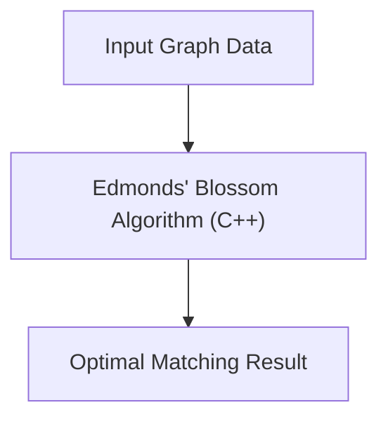

# 🚀 Edmonds Blossom Algorithm

<p align="center"></p>

<p align="center">
  <a href="https://github.com/grewal16/edmonds-blossom-algorithm/stargazers"></a>
  <a href="https://github.com/grewal16/edmonds-blossom-algorithm/network/members"></a>
  <a href="https://github.com/grewal16/edmonds-blossom-algorithm/issues"></a>
  <a href="./LICENSE"></a>
</p>

## Short Description
Dive into the heart of graph theory with this robust C++ implementation of Edmonds' Blossom Algorithm, a pivotal solution for finding maximum weight matchings in general graphs. This project offers a clear, efficient, and well-documented approach to tackling one of the most challenging problems in algorithmic graph theory.

## 🛡️ Project Health & Status
This project represents a stable, well-documented academic implementation of the Edmonds' Blossom Algorithm, complete with a comprehensive report for in-depth understanding. While not designed for continuous integration or extensive test suites, its core functionality is well-defined and demonstrates a solid grasp of the underlying algorithm.

## ✨ Key Features
*   **Accurate Algorithm Implementation**: A precise and efficient C++ rendition of Edmonds' Blossom Algorithm.
*   **General Graph Support**: Capable of finding maximum matchings in any general graph, including those with odd cycles.
*   **In-depth Documentation**: Accompanied by a detailed analytical report (`Report_Implementation_of_Edmonds_Blossom_Algorithm.pdf`) explaining the theory and implementation.
*   **Visual Demonstrations**: Includes animated GIFs (`Inputs.gif`, `Matching.gif`) to visually illustrate the algorithm's input and output.
*   **Clean Codebase**: Written in clean, maintainable C++ for easy understanding and potential extension.

## Who is this for?
This project is an invaluable resource for computer science students, graph theory researchers, algorithm enthusiasts, and anyone looking to deepen their understanding or utilize an efficient solution for maximum matching problems in general graphs.

## Technology Stack & Architecture
This project is a pure, high-performance C++ application designed for efficient computation.
*   **Core Language**: C++
*   **Primary Tool**: Any standard C++ compiler (e.g., g++).

## 📊 Architecture & Database Schema
The architecture of this project is focused on the in-memory execution of the Edmonds' Blossom Algorithm. It takes a graph as input, processes it using the algorithm, and outputs the computed maximum matching.



## ⚙️ Configuration & Deployment
This project is a standalone C++ application. No complex configurations, external services, or containerization are required. Simply compile the source code using a standard C++ compiler.

## ⚡ Quick Start Guide
Get up and running with the Edmonds' Blossom Algorithm in a few simple steps:

1.  **Clone the Repository**:
    ```bash
    git clone https://github.com/grewal16/edmonds-blossom-algorithm.git
    ```
2.  **Navigate to the Project Directory**:
    ```bash
    cd edmonds-blossom-algorithm
    ```
3.  **Compile the Code**:
    Use a C++ compiler like g++ to compile `graph.cpp`:
    ```bash
    g++ graph.cpp -o blossom_matching
    ```
4.  **Run the Executable**:
    Execute the compiled program. It's designed to take graph input and output the matching:
    ```bash
    ./blossom_matching
    ```

## 📜 License
This project is licensed under the terms found in the [LICENSE](LICENSE) file.