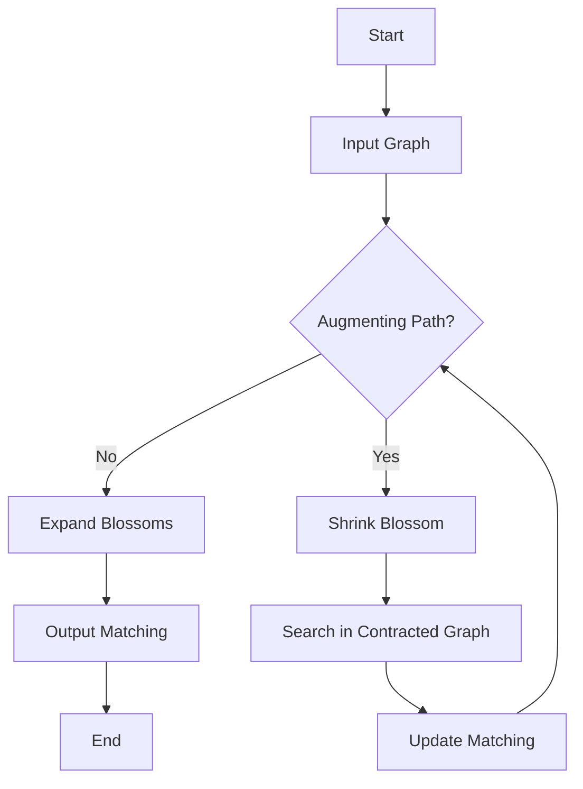

# 🚀 Edmonds Blossom Algorithm Implementation

## Short Description
Dive into the fascinating world of graph theory with a robust and performant C++ implementation of the **Edmonds Blossom Algorithm**! This project provides a clear, efficient, and thoroughly documented solution for finding maximum weight matchings in general graphs, even those containing odd-length cycles (blossoms). Whether you're a student, researcher, or developer, this repository offers a powerful tool and an in-depth understanding of one of combinatorial optimization's most elegant algorithms.

## ✨ Key Features
*   **Optimal Matching:** Accurately computes maximum matchings in any general graph.
*   **Blossom Handling:** Expertly manages odd cycles (blossoms) by contracting and expanding them as per Edmonds' original algorithm.
*   **High Performance:** Implemented in C++ for speed and efficiency, suitable for challenging graph problems.
*   **Visual Comprehension:** Includes illustrative GIFs (`Inputs.gif`, `Matching.gif`) to help visualize the algorithm's process and outcomes.
*   **Comprehensive Documentation:** Features a detailed PDF report (`Report_Implementation_of_Edmonds_Blossom_Algorithm.pdf`) explaining the algorithm's theory and implementation specifics.
*   **Clean Codebase:** Well-structured and commented C++ code (`graph.cpp`) for easy understanding and modification.

## Who is this for?
*   **Computer Science Students:** Ideal for learning advanced graph algorithms, especially maximum matching.
*   **Researchers:** A solid foundation for further research in combinatorial optimization, graph theory, and network analysis.
*   **Algorithm Enthusiasts:** Anyone fascinated by elegant solutions to complex graph problems.
*   **Developers:** Useful as a library or reference for projects requiring maximum matching capabilities.

## Technology Stack & Architecture
This project is primarily implemented in **C++**, focusing on fundamental data structures and algorithmic efficiency. The architecture is centered around a single, self-contained C++ file that encapsulates the graph representation and the Edmonds Blossom algorithm logic.

## 📊 Architecture & Database Schema
The core of this project is the algorithmic flow for finding maximum matchings. Here's a simplified representation of the algorithm's operational flow:



## ⚡ Quick Start Guide

To get this powerful algorithm running on your local machine, follow these simple steps:

1.  **Clone the repository:**
    ```bash
    git clone https://github.com/grewal16/edmonds-blossom-algorithm.git
    cd edmonds-blossom-algorithm
    ```

2.  **Compile the C++ code:**
    You'll need a C++ compiler (like g++).
    ```bash
    g++ graph.cpp -o edmonds_blossom
    ```

3.  **Run the executable:**
    ```bash
    ./edmonds_blossom
    ```
    The program will then execute, demonstrating the Edmonds Blossom Algorithm. Refer to the `Report_Implementation_of_Edmonds_Blossom_Algorithm.pdf` for detailed instructions on input formats and output interpretation.

## 📜 License
Distributed under the License. See `LICENSE` for more information.
