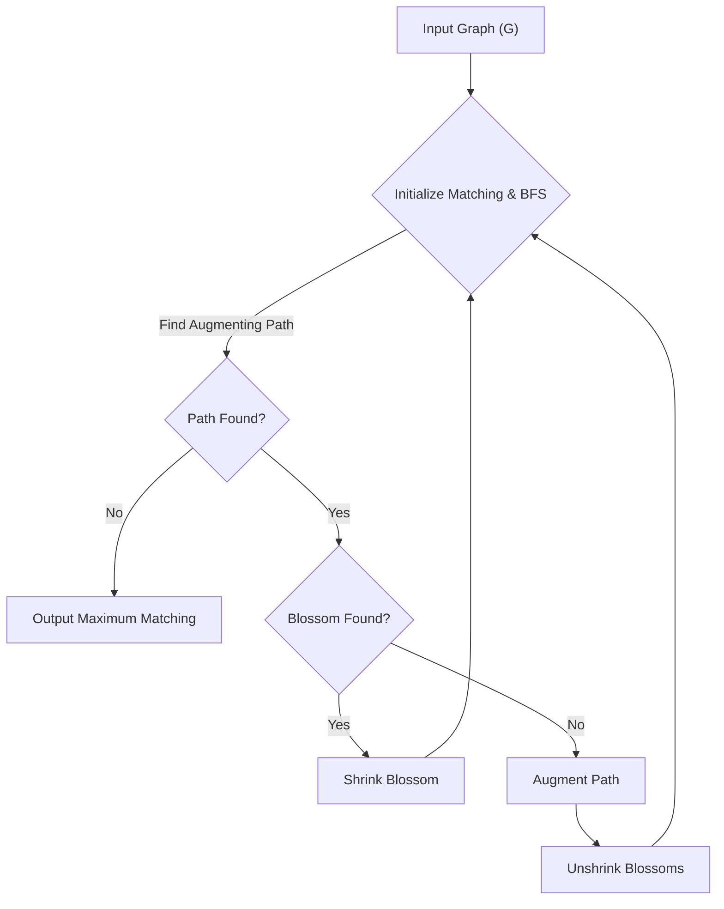

# 🚀 Edmonds Blossom Algorithm

<p align="center"></p>

<p align="center">
  <a href="https://github.com/grewal16/edmonds-blossom-algorithm/stargazers"></a>
  <a href="https://github.com/grewal16/edmonds-blossom-algorithm/network/members"></a>
  <a href="https://github.com/grewal16/edmonds-blossom-algorithm/issues"></a>
  <a href="./LICENSE"></a>
</p>

## Short Description
Unleash the power of optimal matching in general graphs with a robust C++ implementation of the legendary Edmonds Blossom Algorithm. This project allows you to dive deep into complex graph structures and find maximum matchings with unparalleled efficiency, going beyond the limitations of bipartite graphs.

## 🛡️ Project Health & Status
This project provides a stable, well-documented, and thoroughly implemented solution for the Edmonds Blossom Algorithm. It's ready for analytical study, integration into larger systems, or as a foundational piece for academic research in graph theory.

## ✨ Key Features
*   **🚀 Masterful Graph Matching:** A precise and efficient C++ implementation of the Edmonds Blossom Algorithm.
*   **🌐 General Graph Support:** Go beyond bipartite graphs; confidently find maximum matchings in *any* type of graph.
*   **💡 Clear Visual Demonstrations:** Included GIFs (`Inputs.gif`, `Matching.gif`) vividly illustrate the algorithm's process and the resulting matching.
*   **📚 Comprehensive Documentation:** Accompanied by a detailed PDF report (`Report_Implementation_of_Edmonds_Blossom_Algorithm.pdf`) explaining the algorithm's theory and its implementation.
*   **⚡ Optimized Performance:** Designed for effective performance when tackling complex graph scenarios.

## Who is this for?
This project is an invaluable resource for computer science students, algorithm researchers, competitive programmers, and anyone passionate about graph theory and combinatorial optimization looking for a deep dive into advanced matching algorithms.

## Technology Stack & Architecture
*   **Core Language:** C++
*   **Build System:** Standard C++ Compiler (e.g., GCC, Clang)

## 📊 Architecture & Database Schema
The Edmonds Blossom Algorithm is a sophisticated graph algorithm. Below is a high-level flowchart illustrating its core operational flow:



## ⚙️ Configuration & Deployment
This project is a standalone C++ application. It requires a standard C++ compiler (like g++ or Clang) to compile and execute. There are no complex configuration files or external dependencies beyond a basic C++ development environment.

## ⚡ Quick Start Guide
Get up and running with the Edmonds Blossom Algorithm in minutes!

1.  **Clone the repository:**
    ```bash
    git clone https://github.com/grewal16/edmonds-blossom-algorithm.git
    cd edmonds-blossom-algorithm
    ```
2.  **Compile the source code:**
    ```bash
    g++ graph.cpp -o edmonds_blossom
    ```
3.  **Run the executable:**
    ```bash
    ./edmonds_blossom
    ```
    *Note: The program's input method (e.g., command-line arguments, standard input) would typically be detailed within the source code or the accompanying PDF report.*

## 📜 License
This project is licensed under the terms available in the [LICENSE](LICENSE) file.