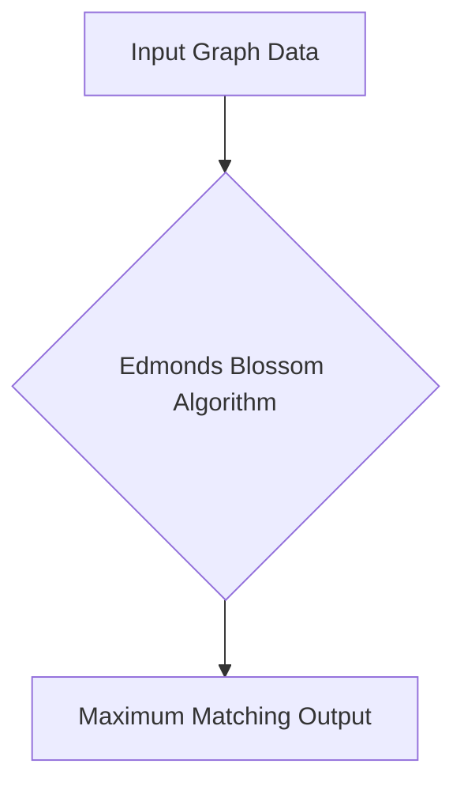

# 🚀 Edmonds Blossom Algorithm

## Short Description
Dive deep into the fascinating world of graph theory with this robust C++ implementation of the classical Edmonds Blossom Algorithm. Designed for efficiency and clarity, this project tackles the challenging problem of finding maximum matchings in general graphs, making complex combinatorial optimization accessible and understandable.

## 🛡️ Project Health & Status
This project provides a functionally complete and meticulously documented implementation of the Edmonds Blossom Algorithm. It is an excellent resource for academic study, algorithmic understanding, and serves as a solid foundation for integration into larger graph processing systems or research initiatives.

## ✨ Key Features
*   **Edmonds Blossom Algorithm Implementation:** A high-performance, core C++ implementation of one of the most significant algorithms in graph theory.
*   **General Graph Support:** Capable of finding maximum matchings across any arbitrary graph, regardless of its structure.
*   **Comprehensive Documentation:** Includes a detailed PDF report (`Report_Implementation_of_Edmonds_Blossom_Algorithm.pdf`) explaining the algorithm's mechanics and implementation specifics.
*   **Illustrative Visualizations:** Comes with animated GIFs (`Inputs.gif`, `Matching.gif`) that demonstrate input graphs and the resulting maximum matchings, aiding in comprehension.

## Who is this for?
This project is an invaluable resource for:
*   **Computer Science Students:** Gaining practical experience with advanced graph algorithms.
*   **Researchers:** Exploring combinatorial optimization and efficient graph matching techniques.
*   **Algorithm Enthusiasts:** Deepening their understanding of fundamental graph theory problems and their solutions.
*   **Developers:** Seeking a C++ reference implementation for maximum matching.

## Technology Stack & Architecture
The project is purely implemented in **C++**, offering a high-performance, low-level solution for complex graph problems. This choice ensures optimal execution speed and direct control over memory, crucial for algorithmic efficiency.

## 📊 Architecture & Database Schema


## ⚙️ Configuration & Deployment
This project is a standalone C++ application. It requires a standard C++ compiler (such as GCC or Clang) to build the executable from the source code. No external libraries or complex configurations are needed beyond the compiler.

## ⚡ Quick Start Guide
To get the Edmonds Blossom Algorithm running on your machine:

1.  **Clone the Repository:**
    ```bash
    git clone https://github.com/grewal16/edmonds-blossom-algorithm.git
    cd edmonds-blossom-algorithm
    ```

2.  **Compile the Source Code:**
    Use a C++ compiler to build the `graph.cpp` file into an executable.
    ```bash
    g++ graph.cpp -o edmonds_blossom
    ```

3.  **Run the Executable:**
    Execute the compiled program. It will process graph data (likely from standard input or a predefined structure within the code) and output the maximum matching.
    ```bash
    ./edmonds_blossom
    ```

## 📜 License
This project is distributed under the terms of the license specified in the `LICENSE` file within this repository. Please review the `LICENSE` file for full details on permitted use and distribution.